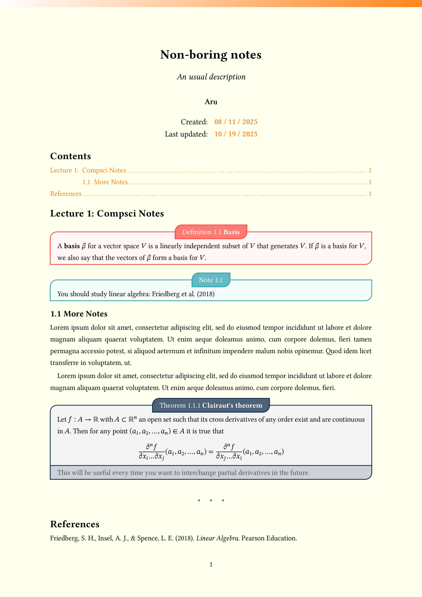

# Typst Note-Taking Templates

This repository provides a collection of templates for taking notes using [Typst](https://typst.app/), a modern typesetting system. The templates are designed to be flexible and customizable for various note-taking needs, from simple assignments to complex.



## Templates

There are three main templates available:

### 1. Minimal

A simple, barebones template suitable for basic notes, homework, or small documents. It includes:

- `main.typ`: The main entry point for your document.
- `utils.typ`: A place for custom utility functions.
- `translated_terms.typ`: A dictionary for multilingual term translations.

### 2. By Chapters

A comprehensive template for notes organized by chapters and sections. This is ideal for a book, thesis, or a long-form course. The structure includes:

- `template-by-chapters.typ`: The main file that sets up the document structure and styling.
- `lib.typ`: A powerful library file containing the core template logic, custom environments, and styling rules.
- `chapters/`: A directory to store your chapter files.
- `sections/`: A directory for sections within chapters.
- `bibliography/`: A dedicated place for your `.bib` bibliography files.

### 3. By Lectures

A template structured for course notes, organized by lectures or days, and grouped into weeks. This is perfect for students or educators. It features:

- `template-by-lectures.typ`: The main document setup file.
- `lib.typ`: The same powerful library as the "By Chapters" template, providing extensive customization.
- `weeks/`: A directory to group your notes by week.
- `days/`: A directory for individual lecture or day notes.
- `bibliography/`: For your bibliography files.

## Features of the Advanced Templates ("By Chapters" and "By Lectures")

The `lib.typ` file in the advanced templates provides a highly customizable `template` function with a wide range of features:

- **Metadata:** Easily set the title, authors, description, and date for your document.
- **Layout:** Control paper size, page color, orientation (landscape/portrait), and column layout.
- **Typography:** Configure fonts for text, code, and mathematical content.
- **Numbering:** Customize numbering for headings, equations, and more.
- **Bibliography:** Built-in support for bibliography files with customizable citation styles.
- **Styling:** Define a global accent color to theme your document.
- **Table of Contents:** Automatically generate a table of contents, as well as lists of figures, tables, and code listings.
- **Custom Environments:** A rich set of pre-defined and beautifully styled environments for:
  - Theorems, Corollaries, Lemmas, Propositions
  - Definitions, Examples, Exercises
  - Notes, Remarks, Tips, Important Notices
  - and many more, powered by the `showybox` package.

## Usage

To get started with a new project, you can use the `create_typst_project.zsh` script.

1. **Make the script executable:**

    ```sh
    chmod +x create_typst_project.zsh
    ```

2. **Run the script with your desired project name:**

    ```sh
    ./create_typst_project.zsh my-awesome-notes
    ```

3. **Choose a template:** The script will prompt you to select one of the available templates (Minimal, By Chapters, or By Lectures).

4. **Project creation:** A new directory with your project name (`my-awesome-notes`) will be created, containing all the files from the selected template. The main `.typ` file will be automatically renamed to match your project name (e.g., `my-awesome-notes.typ`).

5. **Start writing:** Navigate into your new project directory and begin creating your document!
